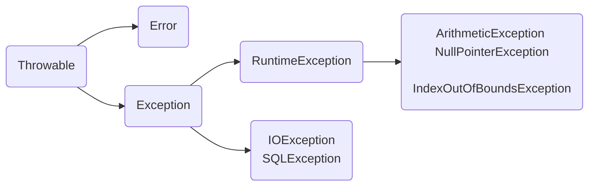

## Class Casting
- 父类引用可以指向子类对象，在此前提下可以强转为子类引用
```java
Object obj = new String();	// upcasting
String str = (String) obj;	// downcasting
```
- 子类引用不能指向父类对象
```java
Object obj = new Object();		
String str = (String) obj;	// ClassCastException
```

## Exception


## Generics
**Producer Extends Consumer Super**
- `<? extends T>`修饰的容器只能往外读(get)，不能往里写(set)，读取的引用只能赋值给类T及其父类
- `<? super T>`修饰的容器可以往里写(set)，但读取的引用只能赋值给Object类

## Comparable vs Comparator
- Comparable 接口位于java.lang，只有一个方法 `int compareTo(Object obj)`
- Comparator 接口位于java.util，只有一个方法 `int compare(Object obj1, Object obj2)`
- 使用 Collections 类提供的static方法对集合 List 进行排序时，要么集合元素实现 Comparable接口，要么提供一个自定义的 Comparator 接口
- Comparator接口是一个函数式接口，传参时可以用 lambda 表达式替代

## String 
```java
String s1 = "abc";            	// constant pool
String s2 = "a" + "b" + "c"; 
String s3 = new String("abc"); 	// heap memory

System.out.println(s1 == s2);   // true
System.out.println(s1 == s3);   // false
```

```java
String s1 = "ab";
String s2 = "abc";
String s3 = s1 + "c";
System.out.println(s2 == s3);  // false
```
```java
final String s1 = "ab";
String s2 = "abc";
String s3 = s1 + "c";
System.out.println(s2 == s3);  // true
```

## Reflection
> 在运行状态中，对于任意一个类，都能够知道这个类的所有属性和方法；对于任意一个对象，都能够调用它的所有属性和方法

**反射机制常用的类**
```java
java.lang.Class;
java.lang.reflect.Constructor;
java.lang.reflect.Field;
java.lang.reflect.Method;
java.lang.reflect.Modifier;
```
**获得Class对象的3种方法**
- `Object.getClass()`
- `obj.class`
- `Class.forName("packageName.ClassName")`
