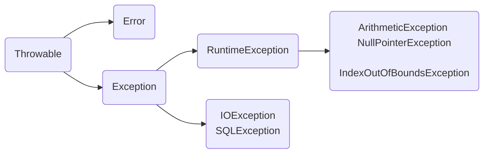

# Java基础
## Comparable vs Comparator
- Comparable 接口位于java.lang，只有一个方法 `int compareTo(Object obj)`
- Comparator 接口位于java.util，只有一个方法 `int compare(Object obj1, Object obj2)`
- 使用 Collections 类提供的static方法对集合 List 进行排序时，要么集合元素实现 Comparable接口，要么提供一个自定义的 Comparator 接口
- Comparator接口是一个函数式接口，传参时可以用 lambda 表达式替代

**Collections.java**
```java
public static <T extends Comparable<? super T>> void sort(List<T> list) {
    list.sort(null);
}

public static <T> void sort(List<T> list, Comparator<? super T> c) {
    list.sort(c);
}
```
**List.java**
```java
default void sort(Comparator<? super E> c) {
    Object[] a = this.toArray();
    Arrays.sort(a, (Comparator) c);
    ListIterator<E> i = this.listIterator();
    for (Object e : a) {
        i.next();
        i.set((E) e);
    }
}
```
**Arrays.java**
```java
public static <T> void sort(T[] a, Comparator<? super T> c) {
    if (c == null) {
        sort(a);
    } else {
        if (LegacyMergeSort.userRequested)
            legacyMergeSort(a, c);
        else
            TimSort.sort(a, 0, a.length, c, null, 0, 0);
    }
}

public static void sort(Object[] a) {
    if (LegacyMergeSort.userRequested)
        legacyMergeSort(a);
    else
        ComparableTimSort.sort(a, 0, a.length, null, 0, 0);
}
```

## Arrays
- `Arrays.asList()` 将数组转换成列表后，不能使用 add/remove/clear 方法，否则会抛出 `UnsupportedOperationException`
- 它返回的是Arrays的内部类，也叫ArrayList，但是该类并没有实现集合的修改方法。
- 它采用了**适配器模式**，只是转换接口，后台的数据仍是数组。
```java
    String[] str = new String[] {"a", "b"};     
    List list = Arrays.asList(str); 
    str[0] = "c"   // list.get(0)也会随之修改。 
```


## Exception

## Class Casting
- 父类引用可以指向子类对象，在此前提下可以强转为子类引用
```java
Object obj = new String();	// upcasting
String str = (String) obj;	// downcasting
```
- 子类引用不能指向父类对象
```java
Object obj = new Object();		
String str = (String) obj;	// ClassCastException
```

## String 
```java
String s1 = "abc";            	// constant pool
String s2 = "a" + "b" + "c"; 
String s3 = new String("abc"); 	// heap memory

System.out.println(s1 == s2);   // true
System.out.println(s1 == s3);   // false
```

```java
String s1 = "ab";
String s2 = "abc";
String s3 = s1 + "c";
System.out.println(s2 == s3);  // false
```
```java
final String s1 = "ab";
String s2 = "abc";
String s3 = s1 + "c";
System.out.println(s2 == s3);  // true
```
## Annotation

## Reflection
> 在运行状态中，对于任意一个类，都能够知道这个类的所有属性和方法；对于任意一个对象，都能够调用它的所有属性和方法

**反射机制常用的类**
```java
java.lang.Class;
java.lang.reflect.Constructor;
java.lang.reflect.Field;
java.lang.reflect.Method;
java.lang.reflect.Modifier;
```
**获得Class对象的3种方法**
- `Object.getClass()`
- `obj.class`
- `Class.forName("packageName.ClassName")`
***

## Generics
**Producer Extends Consumer Super**
- `<? extends T>`修饰的容器只能往外读(get)，不能往里写(set)，读取的引用只能赋值给类T及其父类
- `<? super T>`修饰的容器可以往里写(set)，但读取的引用只能赋值给Object类

***
## Lambda Expression
- 在lambda表达式中，只能引用值不会改变的变量
- 在lambda表达式中，声明一个与外部变量同名的参数或局部变量是不合法的
- 在lambda表达式中，使用 this 关键字时，是指创建这个lambda表达式的方法的this参数

**Method Reference**
- `object::instanceMethod`：所有参数作为 instanceMethod 的参数来调用
- `Class::instanceMethod`：第1个参数作为 instanceMethod 的调用对象，剩余参数作为该方法的参数
- `Class::staticMethod`：所有参数作为 staticMethod 的参数来调用
- `Class::new`：所有参数作为构造器的参数

```java
System.out::println //  x -> System.out.println(x)
this::equals 		//  x -> this.equals(x)

String::equals 		// (x, y) -> x.equals(y)

Math::pow 			// (x，y) -> Math.pow(x, y)

BigDecimal::new 	// x -> new BigDecimal(x)
```

## Stream